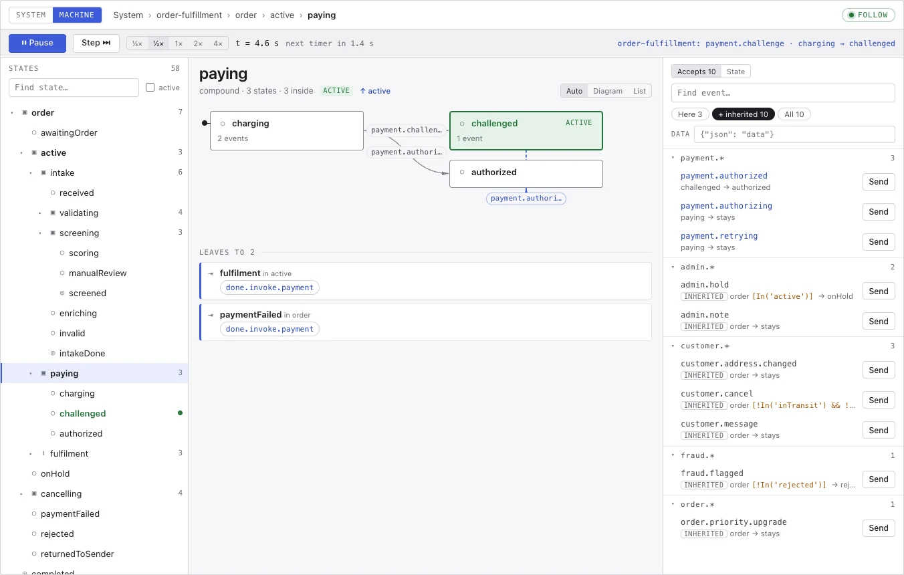

# scxmljs

`@tinyactors/scxmljs` is a correctness-first [SCXML 1.0](https://www.w3.org/TR/scxml/)
interpreter for the ECMAScript data model. It runs directly on DOM elements, and comes with
custom elements that render running statecharts in any framework.

- **Correct:** all 160 automatic mandatory W3C conformance tests pass, with either data model.
- **Two data models, one API:**
  - sandboxed (QuickJS compiled to WebAssembly, one context per session) for charts users write;
  - trusted (the host's own JavaScript engine, about 15 KB gzipped) for charts you ship yourself.
- **Built for visualisation:** typed events, a playback clock that can pause and step, and a
  view-model for the system, tree and focus views of a running chart.

<!-- readme-media:start -->

<!-- readme-media:end -->

Documentation: the [package README](packages/scxmljs/README.md) (also the npm page), the
[guides](docs/README.md), [SECURITY.md](SECURITY.md) and the [changelog](CHANGELOG.md).

## Repository layout

| Path | What |
|---|---|
| `packages/scxmljs/` | the library |
| `examples/playground/` | demo app: the explorer with sample systems, `<scxml-view>`, a GitHub-webhook example |
| `examples/frameworks/` | small React, Vue, Svelte and Angular apps using both elements |
| `conformance/` | the W3C SCXML conformance suite, vendored (`ecma/`), with its runner and fetcher |
| `tests/browser/` | Playwright tests (Chromium, Firefox, WebKit), including screenshot baselines |
| `docs/` | guides, reference and the examples they use |
| `bench/` | benchmark charts and recorded results (`docs/measurements.md` is generated from them) |
| `scripts/` | CI (`scripts/ci`), the release dry run (`scripts/release`), doc tests and link checks (`scripts/docs/`), size, coverage, benchmarks |
| `tools/typedoc/` | the API-reference generator, with its own TypeScript 5 (see `docs/README.md`) |

## Running it

Requires [mise](https://mise.jdx.dev) and [Bun](https://bun.sh).

```sh
bun install
mise run test                  # unit tests
mise run typecheck
mise run conformance           # W3C suite, sandboxed data model (vendored: no network)
mise run conformance:trusted   # W3C suite, trusted data model
mise run up                    # playground on http://localhost:4321 (mise run down to stop)
mise run docs:test             # run every code sample in the docs
mise run docs:api              # API reference into docs/api
scripts/ci                     # light checks (every push and pull request)
scripts/ci --full              # + browsers, visual regression, framework apps, tarball (release preparation)
scripts/release                # release dry run: checks, packs and verifies; never publishes
```

## Contributions

This project doesn't accept outside contributions: pull requests and issues won't be
reviewed. You're welcome to fork it under the terms of the licence.
